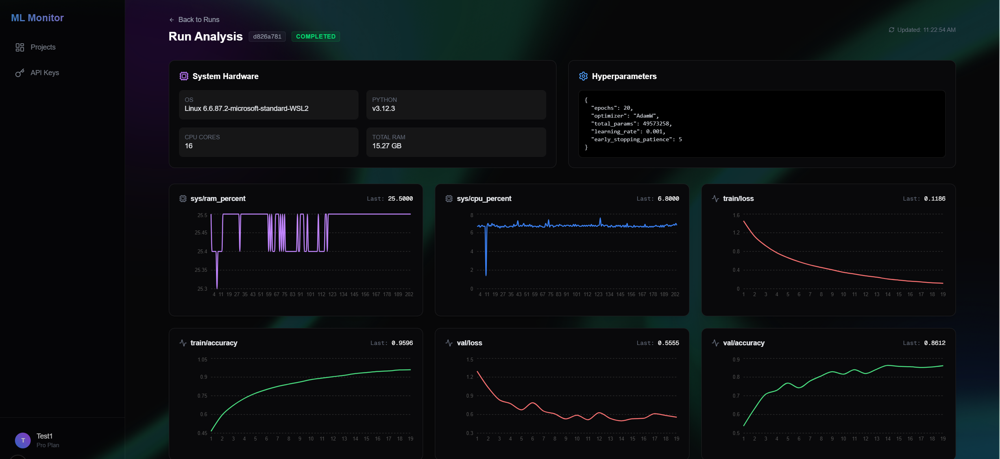

# ML Monitor Python Package


A lightweight and easy-to-use Python package for monitoring machine learning training runs in real-time. This package is the client-side library for the [**ML Monitor Dashboard**](https://monitor.akshatbalyan.me/).

With just a few lines of code, you can track metrics, system utilization, hyperparameters, and the status of your experiments from any Python script.




## Features

-   **Simple API**: `init()`, `log()`, and `finish()` are all you need.
-   **Asynchronous Logging**: A background thread handles all API calls, so your training script is never blocked by network latency.
-   **Automatic System Monitoring**: Automatically tracks CPU & RAM usage and sends it alongside your metrics.
-   **Hyperparameter Tracking**: Store your experiment's configuration (learning rate, batch size, etc.) with each run.
-   **Error & Crash Handling**: Automatically marks a run as `failed` if your script crashes.

## Installation

You can install the package directly from GitHub using pip:

```bash
pip install git+https://github.com/B4K2/Ml-monitoring-package.git
```
or if using `uv`:
```bash
uv pip install git+https://github.com/B4K2/Ml-monitoring-package.git
```

Make sure to install the necessary dependency for system monitoring:
```bash
pip install psutil
```

## Quickstart

Integrate ML Monitor into your training script in three simple steps.

### Prerequisites

1.  Access to a deployed **ML Monitor** instance (either the main service or your self-hosted version).
2.  From your dashboard, create a Project and generate an **API Key**.

### Example: PyTorch Training Script

```python
import torch
import ml_monitor # 1. Import the package

# --- Your Training Setup ---
model = ...
optimizer = ...
EPOCHS = 20
LEARNING_RATE = 0.001

# --- Step 1: Initialize the run ---
# This must be done BEFORE your training loop.
ml_monitor.init(
    project_id="a488c4d1-774f-4cbe-9958-0ebb4cfb5af9", # Your Project ID from the dashboard
    api_key="sk_live_...",                            # Your generated API Key
    run_name="ResNet50_CIFAR10",                       # A custom name for this run
    config={                                          # A dictionary of your hyperparameters
        "epochs": EPOCHS,
        "learning_rate": LEARNING_RATE,
        "optimizer": "AdamW",
        "architecture": "ResNet50"
    }
)

try:
    # --- Your Training Loop ---
    for epoch in range(EPOCHS):
        # ... train your model for one epoch ...
        train_loss = 0.5
        train_acc = 0.85
        
        # ... validate your model ...
        val_loss = 0.4
        val_acc = 0.88

        print(f"Epoch {epoch+1}: Loss={train_loss:.4f}, Val Acc={val_acc:.4f}")
        
        # --- Step 2: Log metrics ---
        # This sends the data to your dashboard in the background.
        ml_monitor.log({
            "train/loss": train_loss,
            "train/accuracy": train_acc,
            "val/loss": val_loss,
            "val/accuracy": val_acc
        }, step=epoch+1)

    # --- Step 3: Finish the run ---
    # Mark the run as completed successfully.
    ml_monitor.finish(status="completed")

except Exception as e:
    print(f"Training crashed: {e}")
    # If anything goes wrong, mark the run as failed.
    ml_monitor.finish(status="failed")
```

## API Reference

### `ml_monitor.init(project_id, api_key, run_name=None, config={})`

Starts a new experiment run and begins background monitoring.

-   **`project_id` (str)**: The UUID of the project this run belongs to.
-   **`api_key` (str)**: The API key for authentication.
-   **`run_name` (str, optional)**: A human-readable name for the run.
-   **`config` (dict, optional)**: A dictionary of hyperparameters to be saved with the run.

### `ml_monitor.log(metrics, step=None)`

Logs a dictionary of metrics for a specific step.

-   **`metrics` (dict)**: A dictionary where keys are metric names (e.g., `"loss"`) and values are numbers.
-   **`step` (int, optional)**: The current step or epoch number. If not provided, a global counter will be auto-incremented.

### `ml_monitor.finish(status="completed")`

Stops the background monitoring, flushes any remaining logs, and updates the final status of the run.

-   **`status` (str, optional)**: The final status. Recommended values are `"completed"`, `"failed"`, or `"stopped"`.

## Configuration (For Self-Hosting)

By default, the package is configured to send data to the primary deployed ML Monitor service. If you are running your own instance of the backend, you can point the package to your server by setting the `ML_MONITOR_URL` environment variable.

```bash
export ML_MONITOR_URL="https://your-ml-monitor-instance.com/api"
```

## Contributing

Contributions are welcome! Please feel free to submit a pull request or open an issue for any bugs or feature requests.